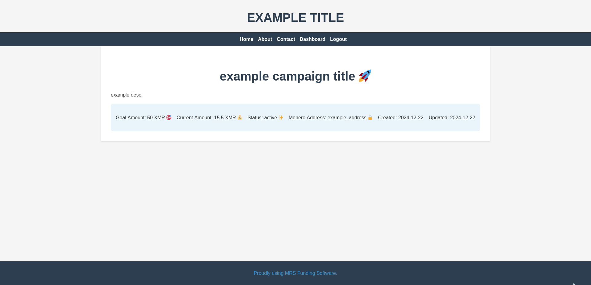
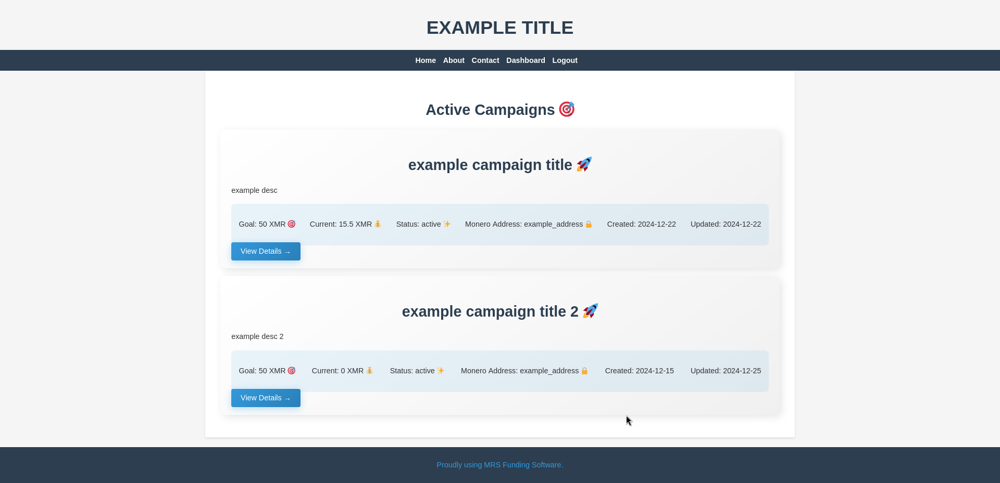
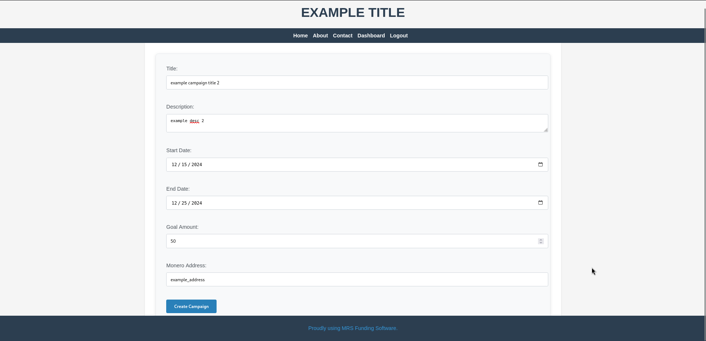
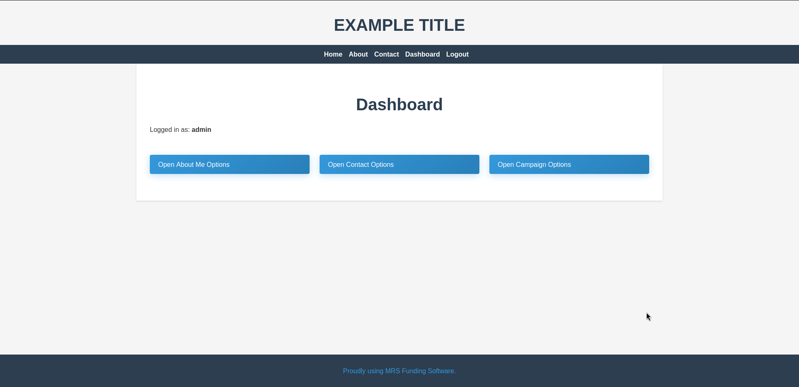

# MRS-Funding-Software 🚀

A self-hosted crowdfunding platform using Monero cryptocurrency 🏠💰.

## Interface Showcase 🖼️

### Home Page
one active campaign

two or more active campaigns


### Campaign Creation


### Admin Dashboard



## Features ✨

- Self-hosted crowdfunding campaigns 🏗️
- Zero JavaScript 🚫📜
- Extremely Simple and Lightweight ⚡
- Privacy-focused 🔒
- [Docker-based deployment (sqlite, nginx proxy) 🐳](docker-compose.yml)
- [Configured WAF 🛡️](https://github.com/owasp-modsecurity/ModSecurity-nginx)

## Prerequisites 📋

- [Docker](https://docs.docker.com/engine/install/) and [Docker compose](https://docs.docker.com/compose/install/) installed 🐋

## Quick Start 🚀

1. Clone the repository:
    ```bash
    git clone https://github.com/KrzysztofMarciniak/MRS-Funding-Software
    ```
2. Navigate to the project directory:
    ```bash
    cd MRS-Funding-Software
    ```

3. Configure environment variables:
    ```bash
    cp .env.example .env
    ```

4. Run docker compose:
    ```bash
    docker compose up -d
    ```
    This will pull SQLite and Nginx images, and build a Rust server image from the [Dockerfile](Dockerfile).

5. Access admin setup:
   - Open http://localhost/login 🔑
   - Log in with your credentials (.env file) 🔐
   - Configure (`About me`), and **other pages**.

6. Configure your own CSS 🎨
   - Create a CSS file inside `src/views/themes/` (for example: `monero.css`)
   - Add your CSS code 
   - Modify the .env file (`ACTIVE_THEME="monero"`)

## Configuration ⚙️

Key configuration options in `.env`:

| Variable | Description | Default |
|----------|-------------|---------|
| DATABASE_URL | SQLite database path | data/mrs_funding.db |
| ADMIN_USERNAME | Admin login username | admin |
| ADMIN_PASSWORD | Admin login password | admin |
| WEBSITE_TITLE | Website title | CHANGE TITLE IN DOT ENV |
| ACTIVE_THEME | Active theme | default |

## Security Considerations 🔒

- Always run Monero wallet RPC with restricted permissions
- Use strong admin passwords 🔑
- Keep system and dependencies updated 🔄
- Enable HTTPS in production 🌐
- Backup campaign data regularly 💾

## License 📜

This project is licensed under the GNU Affero General Public License v3.0 (AGPL-3.0) - see the [LICENSE](LICENSE) file for details.

This means:
- You can freely use, modify, and distribute this software
- If you modify and run this software on a server, you must release your modifications
- Any derivative work must also be licensed under AGPL-3.0
- You must include the original copyright notice and license

## Contributing 🤝

Contributions welcome! Please read [CONTRIBUTING.md](CONTRIBUTING.md) first.

## Notes 📝

This project currently does not include Monero RPC integration to prioritize node security. For optimal privacy and anonymity, we strongly recommend running your own self-hosted Monero node. 